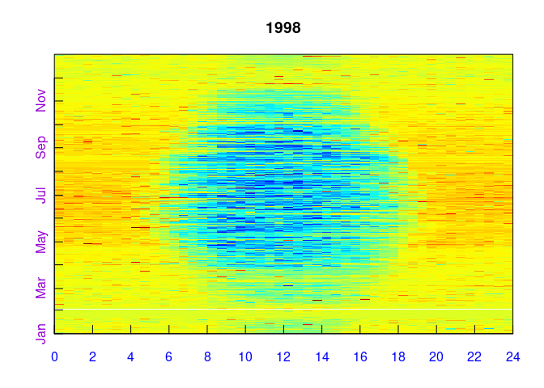

<!-- 
README.md is generated from README.Rmd. Please edit that file
knitr::knit("README.Rmd") 
-->


<!-- 
[](http://cran.r-project.org/package=logitnorm)
-->


## Overview

`REddyProc` package supports processing data from Eddy-Covariance sensors.

There is an online-formular to use the functionality of the package including
description at
<https://www.bgc-jena.mpg.de/bgi/index.php/Services/REddyProcWeb>.

<!-- 
## Installation

```r
# Release stable version from r-forge
install.packages("REddyProc", repos=c("http://R-Forge.R-project.org","@CRAN@"), type="source")

# The the development version from GitHub:
# install.packages("devtools")
devtools::install_github("bgctw/REddyProc")
```
-->

## Usage

A simple example performs Lookuptable-based gapFilling of
Net-Ecosystem-Exchange (NEE) and plotting a fingerprint plot of the filled
values.
 

```r
#library(REddyProc)
Dir.s <- system.file('examples', package='REddyProc')
EddyData.F <- fLoadTXTIntoDataframe('Example_DETha98.txt', Dir.s)
#+++ If not provided, calculate VPD from Tair and rH
EddyData.F <- cbind(EddyData.F,VPD=fCalcVPDfromRHandTair(EddyData.F$rH, EddyData.F$Tair))
#+++ Add time stamp in POSIX time format
EddyDataWithPosix.F <- fConvertTimeToPosix(EddyData.F, 'YDH', Year.s='Year', Day.s='DoY', Hour.s='Hour')
#+++ Initalize R5 reference class sEddyProc for processing of eddy data
#+++ with all variables needed for processing later
EddyProc.C <- sEddyProc$new('DE-Tha', EddyDataWithPosix.F, c('NEE','Rg','Tair','VPD', 'Ustar'))
EddyProc.C$sSetLocationInfo(Lat_deg.n=51.0, Long_deg.n=13.6, TimeZone_h.n=1)  #Location of DE-Tharandt
#
#+++ Fill gaps in variables with MDS gap filling algorithm (without prior ustar filtering)
EddyProc.C$sMDSGapFill('NEE', FillAll.b=FALSE)
#
#+++ Export gap filled and partitioned data to standard data frame
FilledEddyData.F <- EddyProc.C$sExportResults()
#
#+++ Example plots of filled data to screen or to directory \plots
EddyProc.C$sPlotFingerprintY('NEE_f', Year.i=1998)
```


