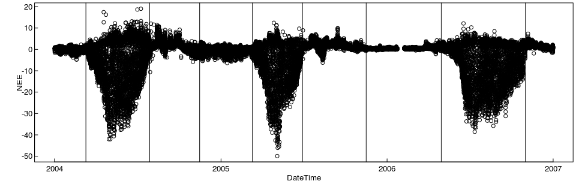

Crop example demonstrating multiple years and user defined uStar-Seasons
========================================================================

    #isDevelopMode <- TRUE
    if (!exists("isDevelopMode")) library(REddyProc)
    set.seed(0815)      # for reproducible results

First, the data is loaded. This example uses data that has been
downloaded from <http://www.europe-fluxdata.eu> and preprocessed by
`fLoadEuroFlux16`, where the DateTime Column has been created, and the
variables renamed to the BGC-convention (e.g. Tair instead of Ta).

    data(DEGebExample)
    summary(DEGebExample)

    ##     DateTime                        NEE              Ustar       
    ##  Min.   :2004-01-01 00:30:00   Min.   :-49.919   Min.   :0.0000  
    ##  1st Qu.:2004-10-01 00:22:30   1st Qu.: -1.864   1st Qu.:0.0640  
    ##  Median :2005-07-02 00:15:00   Median :  0.635   Median :0.1490  
    ##  Mean   :2005-07-02 00:15:00   Mean   : -1.935   Mean   :0.1884  
    ##  3rd Qu.:2006-04-02 00:07:30   3rd Qu.:  1.834   3rd Qu.:0.2800  
    ##  Max.   :2007-01-01 00:00:00   Max.   : 19.008   Max.   :2.0450  
    ##                                NA's   :21849     NA's   :1149    
    ##       Tair               rH               Rg         
    ##  Min.   :-16.710   Min.   : 15.87   Min.   :   0.00  
    ##  1st Qu.:  3.360   1st Qu.: 66.61   1st Qu.:   0.00  
    ##  Median :  9.970   Median : 79.10   Median :   2.04  
    ##  Mean   :  9.664   Mean   : 75.24   Mean   : 124.71  
    ##  3rd Qu.: 15.520   3rd Qu.: 87.07   3rd Qu.: 176.03  
    ##  Max.   : 34.680   Max.   :100.00   Max.   :1046.03  
    ##                    NA's   :1

VPD was not given with the original dataset and is calculated from Tair
and rH.

    DEGebExample$VPD <- fCalcVPDfromRHandTair(DEGebExample$rH, DEGebExample$Tair)
    EProc <- sEddyProc$new('DE-Geb', DEGebExample, c('NEE','Rg','Tair','VPD', 'Ustar'))
    EProc$sSetLocationInfo(LatDeg = 51.1, LongDeg = 10.9, TimeZoneHour = 1)  #Location of Gebesee

Defining Seasons with different surface friction conditions
-----------------------------------------------------------

The site is a crop site. The harvesting times are visible as sharp edges
in the plots of NEE.

The micrometeorological conditions differ between the different cropping
periods, because the friction at the surface differs. Also not the
cropping periods do not correspond very well to seasons. Hence, for the
estimation of uStar-Thresholds, we apply a user-defined splitting of
uStar-seasons. With function `usCreateSeasonFactorYdayYear` we provide
the starting points of the seasons.

Note that, here, the seasons are not constrained within one
calendaryear. There are other variants of a user-specified season that
do respect calendaryear boundaries, or that let seasons start at the
same day each year.

    seasonStarts <- as.data.frame( do.call( rbind, list(
          c(70,2004)
              ,c(210,2004)
              ,c(320,2004)
              ,c(70,2005)
              ,c(180,2005)
              ,c(320,2005)
              ,c(120,2006)
              ,c(305,2006)      
    )))
    seasonFactor <- usCreateSeasonFactorYdayYear(
      DEGebExample$DateTime - 15*60, starts = seasonStarts)
    plot( NEE ~ DateTime, DEGebExample )
    seasonStartsDate <- fConvertTimeToPosix( data.frame(Year = seasonStarts[,2]
        , DoY = seasonStarts[,1], Hour = 0.25), 'YDH'
        , Year = "Year", Day = "DoY", Hour = "Hour")
    abline( v = seasonStartsDate$DateTime)

The user-specific seasoning is provided to the gap-filling by the
argument `seasonFactor`.

    (uStarTh <- EProc$sEstUstarThold(seasonFactor = seasonFactor))

    ##    aggregationMode seasonYear  season      uStar
    ## 1           single         NA    <NA> 0.16041176
    ## 2             year       2004    <NA> 0.13500000
    ## 3             year       2005    <NA> 0.16041176
    ## 4             year       2006    <NA> 0.25094444
    ## 5           season       2004 2004001 0.13500000
    ## 6           season       2004 2004070 0.12037500
    ## 7           season       2004 2004210 0.08925000
    ## 8           season       2005 2004320 0.16041176
    ## 9           season       2005 2005070 0.12533333
    ## 10          season       2005 2005180 0.13473214
    ## 11          season       2006 2005320 0.04842361
    ## 12          season       2006 2006120 0.06966667
    ## 13          season       2006 2006305 0.25094444

    # estimation can be inspected by plotting the saturation of NEE with UStar 
    # for the temperatures of one season
    #EProc$sPlotNEEVersusUStarForSeason( levels(uStarTh$season)[2] )
    # season has been recoreded in EProc:
    if (!("season" %in% names(EProc$sTEMP))) stop("stop1")

Note that there is an estimate for each season. Further, an annual
estimate is obtained by taking the maximum across the seasons, and the
overall estimate is the mean across the years.

By default the gap-filling uses annually aggregated estimates of
uStar-Threshold. This usually works for sites with continuous vegetation
cover. For the crop-site of this example, we will use a different
threshold for each of the defined seasons, by calling
`sEddyProc_useSeaonsalUStarThresholds` before gapfilling.

    #(uStarScens <- usGetSeasonalSeasonUStarMap(uStarTh))
    #if (!("season" %in% names(EProc$sTEMP))) stop("stop2")
    EProc$useSeaonsalUStarThresholds()

    ## 'data.frame':    52608 obs. of  2 variables:
    ##  $ sDateTime: POSIXct, format: "2004-01-01 00:15:00" "2004-01-01 00:45:00" ...
    ##  $ season   : Factor w/ 9 levels "2004001","2004070",..: 1 1 1 1 1 1 1 1 1 1 ...

    EProc$sGetUstarScenarios()

    ##     season      uStar
    ## 5  2004001 0.13500000
    ## 6  2004070 0.12037500
    ## 7  2004210 0.08925000
    ## 8  2004320 0.16041176
    ## 9  2005070 0.12533333
    ## 10 2005180 0.13473214
    ## 11 2005320 0.04842361
    ## 12 2006120 0.06966667
    ## 13 2006305 0.25094444

    EProc$sMDSGapFillAfterUstar('NEE', FillAll = FALSE, isVerbose = FALSE)

Uncertainty introduced by the uStar Threshold estimate: bootstrap
-----------------------------------------------------------------

With a lower estimate of uStar threshold, more records with lower NEE
are kept in the dataset instead of marked as gaps. Therefore annual
estimate of NEE will decrease with lower uStar Threshold. Also the
partitioning of the net-flux to GPP and Reco is sensitive to inclusion
of data at dawn period with conditions of low uStar.

In order to quantify this uncertainty, a lower, median and upper
estimates of uStar are obtained from a bootstrapped sample of
half-hourly NEE measurements. The Gap-Filling and computation of derived
quantities such as GPP are then repeated for different estimates of the
uStar Threshold.

    EProc <- sEddyProc$new('DE-Geb', DEGebExample, c('NEE','Rg','Tair','VPD', 'Ustar'))
    EProc$sSetLocationInfo(LatDeg = 51.1, LongDeg = 10.9, TimeZoneHour = 1)  #Location of Gebesee
    # here, because of processing time only 30 samples instead of 100, and 10% and 90% 
    # percentile instead of default 5%,50%, and 95% with 100 samples
    EProc$sEstimateUstarScenarios( 
      seasonFactor = seasonFactor, nSample = 30L, probs = c(0.1,0.9))
    #(uStarScens <- usGetSeasonalSeasonUStarMap(
    #  EProc$sGetEstimatedUstarThresholdDistribution()
    #))
    #EProc$sSetUstarScenarios(uStarScens)
    EProc$useSeaonsalUStarThresholds()

    ## 
    ## Enter a frame number, or 0 to exit   
    ## 
    ##  1: twDev::genVigs("DEGebExample")
    ##  2: packageTools.R#300: rmarkdown::render(fNameI, output_format = output_f
    ##  3: render(input = input, output_format = format, output_file = NULL, outp
    ##  4: knitr::knit(knit_input, knit_output, envir = envir, quiet = quiet, enc
    ##  5: process_file(text, output)
    ##  6: withCallingHandlers(if (tangle) process_tangle(group) else process_gro
    ##  7: process_group(group)
    ##  8: process_group.block(group)
    ##  9: call_block(x)
    ## 10: block_exec(params)
    ## 11: in_dir(input_dir(), evaluate(code, envir = env, new_device = FALSE, ke
    ## 12: evaluate(code, envir = env, new_device = FALSE, keep_warning = !isFALS
    ## 13: evaluate::evaluate(...)
    ## 14: evaluate_call(expr, parsed$src[[i]], envir = envir, enclos = enclos, d
    ## 15: timing_fn(handle(ev <- withCallingHandlers(withVisible(eval(expr, envi
    ## 16: handle(ev <- withCallingHandlers(withVisible(eval(expr, envir, enclos)
    ## 17: withCallingHandlers(withVisible(eval(expr, envir, enclos)), warning = 
    ## 18: withVisible(eval(expr, envir, enclos))
    ## 19: eval(expr, envir, enclos)
    ## 20: eval(expr, envir, enclos)
    ## 21: EProc$useSeaonsalUStarThresholds()
    ## 
    ## Enter an item from the menu, or 0 to exit

    EProc$sGetUstarScenarios()

    ##     season      uStar        U10        U90
    ## 5  2004001 0.13500000 0.10174000 0.16030000
    ## 6  2004070 0.12037500 0.09632500 0.12268889
    ## 7  2004210 0.08925000 0.10499293 0.19000727
    ## 8  2004320 0.16041176 0.09918212 0.17438050
    ## 9  2005070 0.12533333 0.11512857 0.17554643
    ## 10 2005180 0.13473214 0.08448929 0.14519000
    ## 11 2005320 0.04842361 0.05055000 0.08105208
    ## 12 2006120 0.06966667 0.06480909 0.08695350
    ## 13 2006305 0.25094444 0.10060806 0.26186553

After setting the uStar scenarios, they will be used by method
`sMDSGapFillUStarScens`.

    EProc$sMDSGapFillUStarScens('NEE', FillAll = FALSE)

Additional output columns are produced for each uStar quantile.

    grep("^NEE.*_f$", colnames( EProc$sExportResults()), value = TRUE )

    ## character(0)

Several methods provide processing steps for all scenarios. In addition,
method `sApplyUStarScen` calls a user-specified function repeatedly with
a mofified argument `suffix`. For example, the flux partitioning across
all threshold scenarios can be invoked by the following code to produce
several GPP estimates.

    EProc$sMDSGapFill('Tair', FillAll = FALSE)
    EProc$sApplyUStarScen( EProc$sMRFluxPartition )
    #grep("U10", colnames(EProc$sExportResults()), value = TRUE)    
    grep("^GPP.*_f$", colnames( EProc$sExportResults()), value = TRUE )

    ## [1] "GPP_uStar_f" "GPP_U10_f"   "GPP_U90_f"

Using change point detection instead of moving point method for UStar Threshold estimation
------------------------------------------------------------------------------------------

The package also provides another method of estimating the point where
NEE saturates with increasing uStar. With the ChangePointDetection (CPT)
method, the data is not binned by classes of uStar but the changepoint
is estimated based on the entire subset within one seasons and one
temperature class. The user invokes this method by specifying argument
`ctrlUstarEst.l = usControlUstarEst(isUsingCPTSeveralT = TRUE)` to
`EstUstarThold` or `sEstUstarThresholdDistribution`.

The CPT method is usually yields higher thresholds and marks more data
as Gap.

    EProc <- sEddyProc$new(
      'DE-Geb', DEGebExample, c('NEE','Rg','Tair','VPD', 'Ustar'))
    resUStar <- EProc$sEstUstarThold(
                        ctrlUstarEst = usControlUstarEst(isUsingCPTSeveralT = TRUE)
                        , seasonFactor = seasonFactor
                )
    #(uStarThCP <- usGetSeasonalSeasonUStarMap(resUStar))
    EProc$useSeaonsalUStarThresholds()

    ## 
    ## Enter a frame number, or 0 to exit   
    ## 
    ##  1: twDev::genVigs("DEGebExample")
    ##  2: packageTools.R#300: rmarkdown::render(fNameI, output_format = output_f
    ##  3: render(input = input, output_format = format, output_file = NULL, outp
    ##  4: knitr::knit(knit_input, knit_output, envir = envir, quiet = quiet, enc
    ##  5: process_file(text, output)
    ##  6: withCallingHandlers(if (tangle) process_tangle(group) else process_gro
    ##  7: process_group(group)
    ##  8: process_group.block(group)
    ##  9: call_block(x)
    ## 10: block_exec(params)
    ## 11: in_dir(input_dir(), evaluate(code, envir = env, new_device = FALSE, ke
    ## 12: evaluate(code, envir = env, new_device = FALSE, keep_warning = !isFALS
    ## 13: evaluate::evaluate(...)
    ## 14: evaluate_call(expr, parsed$src[[i]], envir = envir, enclos = enclos, d
    ## 15: timing_fn(handle(ev <- withCallingHandlers(withVisible(eval(expr, envi
    ## 16: handle(ev <- withCallingHandlers(withVisible(eval(expr, envir, enclos)
    ## 17: withCallingHandlers(withVisible(eval(expr, envir, enclos)), warning = 
    ## 18: withVisible(eval(expr, envir, enclos))
    ## 19: eval(expr, envir, enclos)
    ## 20: eval(expr, envir, enclos)
    ## 21: EProc$useSeaonsalUStarThresholds()

    EProc$sGetUstarScenarios()

    ##     season     uStar
    ## 5  2004001 0.5454669
    ## 6  2004070 0.1203274
    ## 7  2004210 0.2144359
    ## 8  2004320 0.1558058
    ## 9  2005070 0.1558058
    ## 10 2005180 0.1558058
    ## 11 2005320 0.3506363
    ## 12 2006120 0.3506363
    ## 13 2006305 0.3506363
