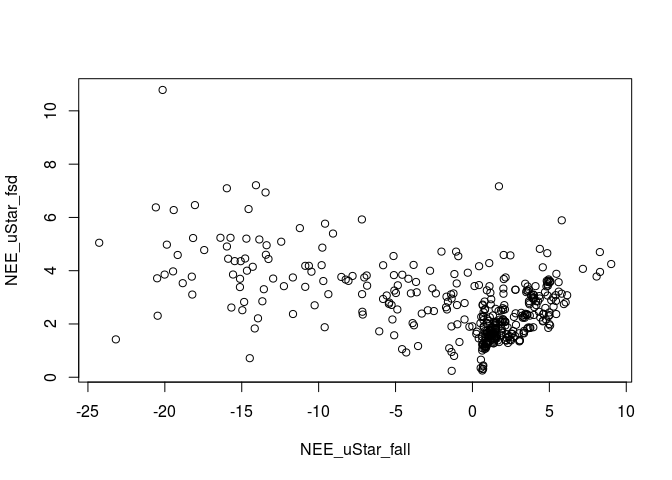
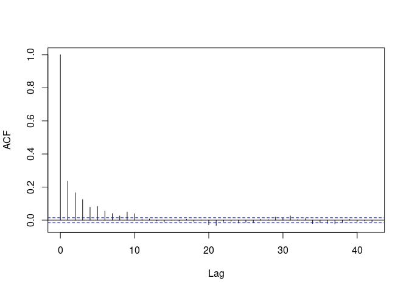
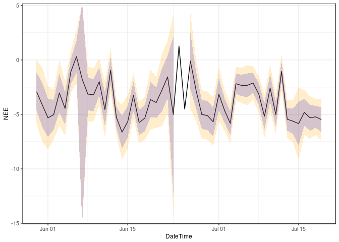

# Aggregating uncertainty to daily and annual values

## Example setup

We start with half-hourly *u*\*-filtered and gapfilled NEE\_f
values. For simplicity this example uses data provided with the package
and omits *u*\* threshold detection but rather applies a
user-specified threshold.

With option `FillAll = TRUE`, an uncertainty, specifically the standard
deviation, of the flux is estimated for each record during gapfilling
and stored in variable `NEE_uStar_fsd`.

    library(REddyProc)
    library(dplyr)
    EddyDataWithPosix <- Example_DETha98 %>% 
      filterLongRuns("NEE") %>% 
      fConvertTimeToPosix('YDH',Year = 'Year',Day = 'DoY', Hour = 'Hour')
    EProc <- sEddyProc$new(
      'DE-Tha', EddyDataWithPosix, c('NEE','Rg','Tair','VPD', 'Ustar'))
    EProc$sMDSGapFillAfterUstar('NEE', uStarTh = 0.3, FillAll = TRUE)
    results <- EProc$sExportResults() 
    results_good <- results %>% filter(NEE_uStar_fqc <= 1) 
    summary(results_good$NEE_uStar_fsd)

    ##     Min.  1st Qu.   Median     Mean  3rd Qu.     Max. 
    ##  0.03535  1.69194  2.31331  2.70544  3.39922 17.19675

We can inspect, how the uncertainty scales with the flux magnitude.

    results_good %>% slice(sample.int(nrow(results_good),400)) %>% 
    plot( NEE_uStar_fsd ~ NEE_uStar_fall, data = . )

## Omitting problematic records

REddyProc flags filled data with poor gap-filling by a quality flag in
`NEE_<uStar>_fqc` &gt; 0 but still reports the fluxes. For aggregation
we recommend computing the mean including those gap-filled records,
i.e. using `NEE_<uStar>_f` instead of `NEE_orig`. However, for
estimating the uncertainty of the aggregated value, the the gap-filled
records should not contribute to the reduction of uncertainty due to
more replicates.

Hence, first we create a column similar `NEE_orig_sd` to
`NEE_<uStar>_fsd` but where the estimated uncertainty is set to missing
for the gap-filled records.

    results <- EProc$sExportResults() %>% 
      mutate(
        NEE_orig_sd = ifelse(
          is.finite(.data$NEE_uStar_orig), .data$NEE_uStar_fsd, NA),
        NEE_uStar_fgood = ifelse(
          is.finite(.data$NEE_uStar_fqc <= 1), .data$NEE_uStar_f, NA)
    )

If the aggregated mean should be computed excluding poor
quality-gap-filled data, then its best to use a column with values set
to missing for poor quality, e.g. using `NEE_<uStar>_fgood` instead of
`NEE_<uStar>_f`. However, the bias in aggregated results can be larger
when omitting records, e.g. consistently omitting more low night-time
fluxes, than with using poor estimates of those fluxes.

## Random error

For a given u\* threshold, the aggregation across time uses many
records. The random error in each record, i.e. `NEE_fsd`, is only
partially correlated to the random error to records close by. Hence, the
relative uncertainty of the aggregated value decreases compared to the
average relative uncertainty of the individual observations.

### Wrong aggregation without correlations

With neglecting correlations among records, the uncertainty of the mean
annual flux is computed by adding the variances. The mean is computed by
*m* = ∑*x**i*/*n*. And hence its standard deviation by
$sd(m) = \\sqrt{Var(m)}= \\sqrt{\\sum{Var(x\_i)}/n^2} = \\sqrt{n \\bar{\\sigma^2}/n^2} = \\bar{\\sigma^2}/\\sqrt{n}$.
This results in an approximate reduction of the average standard
deviation $\\bar{\\sigma^2}$ by $\\sqrt{n}$.

    results %>% summarise(
      nRec = sum(is.finite(NEE_orig_sd))
      , NEEagg = mean(NEE_uStar_f)
      , varSum = sum(NEE_orig_sd^2, na.rm = TRUE)
      , seMean = sqrt(varSum) / nRec
      , seMeanApprox = mean(NEE_orig_sd, na.rm = TRUE) / sqrt(nRec)
      ) %>% select(NEEagg, nRec, seMean, seMeanApprox)

    ##      NEEagg  nRec     seMean seMeanApprox
    ## 1 -1.657303 10901 0.02988839   0.02650074

Due to the large number of records, the estimated uncertainty is very
low.

### Considering correlations

When observations are not independent of each other, the formulas now
become *V**a**r*(*m*) = *s*2/*n**e**f**f* where
$s^2 = \\frac{n\_{eff}}{n(n\_{eff}-1)} \\sum\_{i=1}^n \\sigma\_i^2$, and
with the number of effective observations *n**e**f**f*
decreasing with the autocorrelation among records (Bayley 1946, Zieba
2011).

The average standard deviation $\\sqrt{\\bar{\\sigma^2\_i}}$ now
approximately decreases only by about $\\sqrt{n\_{eff}}$:

$$
Var(m) = \\frac{s^2}{n\_{eff}} 
= \\frac{\\frac{n\_{eff}}{n(n\_{eff}-1)} \\sum\_{i=1}^n \\sigma\_i^2}{n\_{eff}}
= \\frac{1}{n(n\_{eff}-1)} \\sum\_{i=1}^n \\sigma\_i^2 \\\\
= \\frac{1}{n(n\_{eff}-1)} n \\bar{\\sigma^2\_i} = \\frac{\\bar{\\sigma^2\_i}}{(n\_{eff}-1)} 
$$

First we need to quantify the error terms, i.e. model-data residuals.
For all the records of good quality, we have an original measured value
`NEE_uStar_orig` and modelled value from MDS gapfilling,
`NEE_uStar_fall`.

For computing autocorrelation, equidistant time steps are important.
Hence, instead of filtering, the residuals of bad-quality data are set
to missing.

    results <- EProc$sExportResults() %>% 
      mutate(
        resid = ifelse(NEE_uStar_fqc == 0, NEE_uStar_orig - NEE_uStar_fall, NA)
        ,NEE_orig_sd = ifelse(
          is.finite(.data$NEE_uStar_orig), .data$NEE_uStar_fsd, NA)
      )

Now we can inspect the the autocorrelation of the errors.

    acf(results$resid, na.action = na.pass, main = "")

The empirical autocorrelation function shows strong positive
autocorrelation in residuals up to a lag of 10 records.

Computation of effective number of observations is provided by function
`computeEffectiveNumObs` from package `lognorm` based on the empirical
autocorrelation function for given model-data residuals. Note that this
function needs to be applied to the series including all records, i.e. 
not filtering quality flag before.

    autoCorr <- lognorm::computeEffectiveAutoCorr(results$resid)
    nEff <- lognorm::computeEffectiveNumObs(results$resid, na.rm = TRUE)
    c(nEff = nEff, nObs = sum(is.finite(results$resid)))

    ##      nEff      nObs 
    ##  4230.522 10901.000

We see that the effective number of observations is only about a third
of the number of observations.

Now we can use the formulas for the sum and the mean of correlated
normally distributed variables to compute the uncertainty of the mean.

    resRand <- results %>% summarise(
      nRec = sum(is.finite(NEE_orig_sd))
      , NEEagg = mean(NEE_uStar_f, na.rm = TRUE)
      , varMean = sum(NEE_orig_sd^2, na.rm = TRUE) / nRec / (!!nEff - 1)
      , seMean = sqrt(varMean) 
      #, seMean2 = sqrt(mean(NEE_orig_sd^2, na.rm = TRUE)) / sqrt(!!nEff - 1)
      , seMeanApprox = mean(NEE_orig_sd, na.rm = TRUE) / sqrt(!!nEff - 1)
      ) %>% select(NEEagg, seMean, seMeanApprox)
    resRand

    ##      NEEagg     seMean seMeanApprox
    ## 1 -1.657303 0.04798329   0.04254471

The aggregated value is the same, but its uncertainty increased compared
to the computation neglecting correlations.

Note, how we used `NEE_uStar_f` for computing the mean, but
`NEE_orig_sd` instead of `NEE_uStar_fsd` for computing the uncertainty.

### Daily aggregation

When aggregating daily respiration, the same principles hold.

However, when computing the number of effective observations, we
recommend using the empirical autocorrelation function estimated on
longer time series of residuals (`autoCorr` computed above) in
`computeEffectiveNumObs` instead of estimating them from the residuals
of each day.

First, create a column DoY to subset records of each day.

    results <- results %>% mutate(
      DateTime = EddyDataWithPosix$DateTime     # take time stamp form input data
      , DoY = as.POSIXlt(DateTime - 15*60)$yday # midnight belongs to the previous
    )

Now the aggregation can be done on data grouped by DoY. The notation
`!!` tells `summarise` to use the variable `autoCorr` instead of a
column with that name.

    aggDay <- results %>% 
      group_by(DoY) %>% 
      summarise(
        DateTime = first(DateTime)
        ,nEff = lognorm::computeEffectiveNumObs(
           resid, effAcf = !!autoCorr, na.rm = TRUE)
        , nRec = sum(is.finite(NEE_orig_sd))
        , NEE = mean(NEE_uStar_f, na.rm = TRUE)
        , sdNEE = if (nEff <= 1) NA_real_ else sqrt(
          mean(NEE_orig_sd^2, na.rm = TRUE) / (nEff - 1)) 
        , sdNEEuncorr = if (nRec <= 1) NA_real_ else sqrt(
           mean(NEE_orig_sd^2, na.rm = TRUE) / (nRec - 1))
        , .groups = "drop_last"
      )
    aggDay

    ## # A tibble: 365 x 7
    ##      DoY DateTime             nEff  nRec      NEE  sdNEE sdNEEuncorr
    ##    <int> <dttm>              <dbl> <int>    <dbl>  <dbl>       <dbl>
    ##  1     0 1998-01-01 00:30:00 11.0     21  0.124    0.760       0.536
    ##  2     1 1998-01-02 00:30:00  3.66     7  0.00610  1.56        1.04 
    ##  3     2 1998-01-03 00:30:00  0        0  0.0484  NA          NA    
    ##  4     3 1998-01-04 00:30:00  0        0  0.303   NA          NA    
    ##  5     4 1998-01-05 00:30:00 10.9     28  0.195    0.861       0.521
    ##  6     5 1998-01-06 00:30:00 18.0     48  0.926    0.615       0.370
    ##  7     6 1998-01-07 00:30:00 18.0     48 -0.337    0.566       0.340
    ##  8     7 1998-01-08 00:30:00 17.7     46 -0.139    0.525       0.320
    ##  9     8 1998-01-09 00:30:00 17.5     45  0.614    0.474       0.290
    ## 10     9 1998-01-10 00:30:00 15.4     36  0.242    0.641       0.411
    ## # … with 355 more rows

The confidence bounds (+-1.96 stdDev) computed with accounting for
correlations in this case are about twice the ones computed with
neglecting correlations.

## u\* threshold uncertainty

There is also uncertainty due to unknown u\* threshold. Since, the same
threshold is used for all times in a given uStar scenario, the relative
uncertainty of this component does not decrease when aggregating across
time.

The strategy is to

1\. estimate distribution of u\* threshold

2\. compute time series of NEE (or other values of interest) for draws
from this distribution, i.e. for many uStar-scenarios

3\. compute each associated aggregated value

4\. and then look at the distribution of the aggregated values.

Note that the entire processing down to the aggregated value has to be
repeated for each uStar scenario. Hence, obtaining a good estimate of
this uncertainty is computationally expensive.

1\. First, we estimate many samples of the probability density of the
unknown uStar threshold.

    # for run-time of the vignette creation, here we use only few uStar quantiles
    # For real-world applications, a larger sample is required.
    nScen <- 3 # nScen <- 39

    EddyDataWithPosix <- Example_DETha98 %>% 
      filterLongRuns("NEE") %>% 
      fConvertTimeToPosix('YDH',Year = 'Year',Day = 'DoY', Hour = 'Hour')
    EProc <- sEddyProc$new(
      'DE-Tha', EddyDataWithPosix, c('NEE','Rg','Tair','VPD', 'Ustar'))
    EProc$sEstimateUstarScenarios( 
      nSample = nScen*4, probs = seq(0.025,0.975,length.out = nScen) )
    uStarSuffixes <- colnames(EProc$sGetUstarScenarios())[-1]
    uStarSuffixes # in real world should use > 30

    ## [1] "uStar" "U2.5"  "U50"   "U97.5"

2\. Produce time series of gapfilled NEE for each scenario. They are
stored in columns distinguished by a suffix with the quantile.

    EProc$sMDSGapFillUStarScens('NEE')

3\. Compute the annual mean for each scenario. Method
`sEddyProc_sApplyUStarScen` calls a user-provided function that takes an
argument suffix for each u\*-threshold scenario. Here, we use it to
create the corresponding NEE column name and compute mean across this
column in the data exported from REddyProc.

    computeMeanNEE <- function(ds, suffix){
      column_name <- paste0("NEE_",suffix,"_f")
      mean(ds[[column_name]])
    }
    FilledEddyData <- EProc$sExportResults()
    NEEagg <- unlist(EProc$sApplyUStarScen(computeMeanNEE, FilledEddyData))
    NEEagg

    ##     uStar      U2.5       U50     U97.5 
    ## -1.616926 -1.630803 -1.618933 -1.646267

4\. compute uncertainty across aggregated values

    sdNEEagg_ustar <- sd(NEEagg)
    sdNEEagg_ustar

    ## [1] 0.01349296

## Combined aggregated uncertainty

Assuming that the uncertainty due to unknown u\*threshold is independent
from the random uncertainty, the variances add.

    sdAnnual <- data.frame(
      sdRand = resRand$seMean,
      sdUstar = sdNEEagg_ustar,
      sdComb = sqrt(resRand$seMean^2 + sdNEEagg_ustar^2) 
    )
    sdAnnual

    ##       sdRand    sdUstar     sdComb
    ## 1 0.04798329 0.01349296 0.04984432
