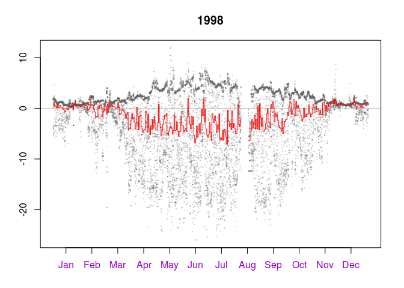

Extended usage of the gap filling algorithm
===========================================

    #+++ load libraries used in this vignette
    library(REddyProc)
    library(dplyr)
    #+++ Add time stamp in POSIX time format
    EddyDataWithPosix <- fConvertTimeToPosix(
      Example_DETha98, 'YDH', Year = 'Year', Day = 'DoY', Hour = 'Hour')

    #+++ Add some (non-sense) example vectors:
    #+++ Quality flag vector (e.g. from applying ustar filter)
    QF <- rep(c(1, 0, 1, 0, 1, 0, 0, 0, 0, 0), nrow(EddyDataWithPosix) / 10)
    #+++ Dummy step function vector to simulate e.g. high / low water table
    Step <- ifelse(EddyDataWithPosix$DoY < 200 | EddyDataWithPosix$DoY > 250, 0, 1)

    #+++ Initialize new sEddyProc processing class with more columns
    EProc <- sEddyProc$new(
      'DE-Tha', cbind(EddyDataWithPosix, Step = Step, QF = QF)
      , c('NEE', 'LE', 'H', 'Rg', 'Tair', 'Tsoil', 'rH', 'VPD', 'QF', 'Step'))

    #+++ Gap fill variable with (non-default) variables and limits
    # including preselection of data with quality flag QF == 0
    EProc$sMDSGapFill(
      'LE', QFVar = 'QF', QFValue = 0, V1 = 'Rg', T1 = 30, V2 = 'Tsoil', T2 = 2
      , 'Step', 0.1)

    #+++ Use individual gap filling subroutines with different window sizes
    # and up to five variables and limits
    EProc$sFillInit('NEE') #Initialize 'NEE' as variable to fill
    Result_Step1.F <- EProc$sFillLUT(
      3, 'Rg', 50, 'rH', 30, 'Tair', 2.5, 'Tsoil', 2, 'Step', 0.5)
    Result_Step2.F <- EProc$sFillLUT(6, 'Tair', 2.5, 'VPD', 3, 'Step', 0.5)
    Result_Step3.F <- EProc$sFillMDC(3)
    #Individual fill result columns are called 'VAR_...'
    EProc$sPlotHHFluxesY('VAR_fall', Year = 1998)

Explicit demonstration of MDS algorithm for NEE gap filling
===========================================================

    EProcMDS <- sEddyProc$new(
      'DE-Tha', EddyDataWithPosix, c('NEE', 'Rg', 'Tair', 'VPD'))
    #Initialize 'NEE' as variable to fill
    EProcMDS$sFillInit('NEE')
    # Set variables and tolerance intervals
    V1 = 'Rg'; T1 = 50 # Global radiation 'Rg' within +/-50 W m-2
    V2 = 'VPD'; T2 = 5 # Vapour pressure deficit 'VPD' within 5 hPa
    V3 = 'Tair'; T3 = 2.5 # Air temperature 'Tair' within +/-2.5 degC
    # Step 1: Look-up table with window size +/-7 days
    ResultStep1 <- EProcMDS$sFillLUT(7, V1, T1, V2, T2, V3, T3)
    # Step 2: Look-up table with window size +/-14 days
    ResultStep2 <- EProcMDS$sFillLUT(14, V1, T1, V2, T2, V3, T3)
    # Step 3: Look-up table with window size +/-7 days, Rg only
    ResultStep3 <- EProcMDS$sFillLUT(7, V1, T1)
    # Step 4: Mean diurnal course with window size 0 (same day)
    ResultStep4 <- EProcMDS$sFillMDC(0)
    # Step 5: Mean diurnal course with window size +/-1, +/-2 days
    ResultStep5a <- EProcMDS$sFillMDC(1)
    ResultStep5b <- EProcMDS$sFillMDC(2)
    # Step 6: Look-up table with window size +/-21, +/-28, ..., +/-70
    for (WinDays in seq(21, 70, 7) ) 
      ResultStep6 <- EProcMDS$sFillLUT(WinDays, V1, T1, V2, T2, V3, T3)
    # Step 7: Look-up table with window size +/-14, +/-21, ..., +/-70, Rg only
    for (WinDays in seq(14, 70, 7) ) 
      ResultStep7 <- EProcMDS$sFillLUT(WinDays, V1, T1)
    # Step 8: Mean diurnal course with window size +/-7, +/-14, ..., +/-210 days
    for (WinDays in seq(7, 210, 7) ) 
      ResultStep8 <- EProcMDS$sFillMDC(WinDays)
    # Export results, columns are named 'VAR_'
    FilledEddyData <- EProcMDS$sExportResults()
    head(FilledEddyData)

    ##   VAR_orig     VAR_f VAR_fqc VAR_fall VAR_fall_qc VAR_fnum  VAR_fsd
    ## 1    -1.21 -1.210000       0 1.373704           1       54 2.531604
    ## 2     1.72  1.720000       0 1.396364           1       55 2.513678
    ## 3       NA  1.006569       1 1.006569           1       58 3.311918
    ## 4       NA  1.061343       1 1.061343           1       67 3.164355
    ## 5     2.55  2.550000       0 1.071176           1       68 3.141698
    ## 6       NA  1.205441       1 1.205441           1       68 2.884610
    ##   VAR_fmeth VAR_fwin
    ## 1         1       14
    ## 2         1       14
    ## 3         1       14
    ## 4         1       14
    ## 5         1       14
    ## 6         1       14
