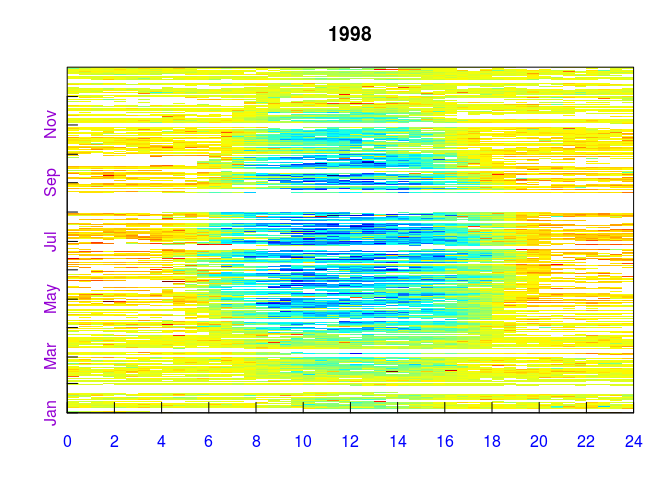
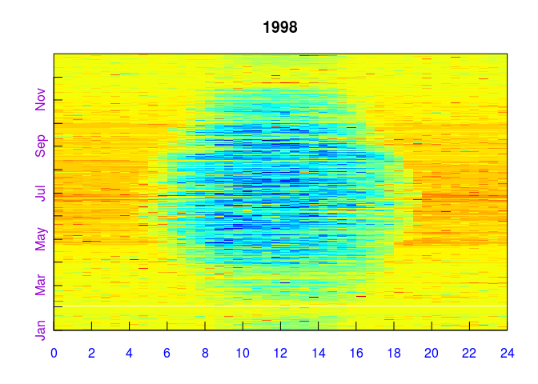
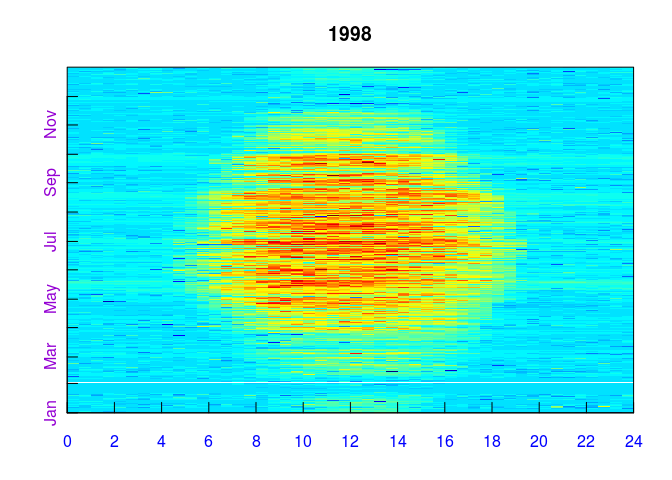

REddyProc typical workflow
==========================

Importing the half-hourly data
------------------------------

The workflow starts with importing the half-hourly data. The example,
reads a text file with data of the year 1998 from the Tharandt site and
converts the separate decimal columns year, day, and hour to a POSIX
timestamp column. Next, it initializes the `sEddyProc` class.

    #+++ load libraries used in this vignette
    library(REddyProc)
    library(dplyr)
    #+++ Load data with 1 header and 1 unit row from (tab-delimited) text file
    fileName <- getExamplePath('Example_DETha98.txt', isTryDownload = TRUE)
    EddyData <- if (length(fileName)) fLoadTXTIntoDataframe(fileName) else
      # or use example dataset in RData format provided with REddyProc
      Example_DETha98
    #+++ Add time stamp in POSIX time format
    EddyDataWithPosix <- fConvertTimeToPosix(
      EddyData, 'YDH',Year = 'Year',Day = 'DoY', Hour = 'Hour')
    #+++ Initalize R5 reference class sEddyProc for post-processing of eddy data
    #+++ with the variables needed for post-processing later
    EProc <- sEddyProc$new(
      'DE-Tha', EddyDataWithPosix, c('NEE','Rg','Tair','VPD', 'Ustar'))

A fingerprint-plot of the source half-hourly shows already several gaps.
A fingerprint-plot is a color-coded image of the half-hourly fluxes by
daytime on the x and and day of the year on the y axis.

    EProc$sPlotFingerprintY('NEE', Year = 1998)

For writing plots of data of several years to pdf see also

-   [`sEddyProc_sPlotFingerprint`](../html/sEddyProc_sPlotFingerprint.html),
-   [`sEddyProc_sPlotHHFluxes`](../html/sEddyProc_sPlotHHFluxes.html),
    and
-   [`sEddyProc_sPlotDiurnalCycle`](../html/sEddyProc_sPlotDiurnalCycle.html).

Estimating the uStar threshold distribution
-------------------------------------------

The second step, is the estimation of the distribution of uStar
thresholds, to identify periods of low friction velocity (uStar), where
NEE is biased low. Discarding periods with low uStar is one of the
largest sources of uncertainty in aggregated fluxes. Hence, several
quantiles of the distribution of the uncertain uStar threshold are
estimated by a bootstrap.

The friction velocity, uStar, needs to be in column named "Ustar" of the
input dataset.

    EProc$sEstimateUstarScenarios(
        nSample = 100L, probs = c(0.05, 0.5, 0.95))

    ## Warning in .estimateUStarSeason(...): sEstUstarThreshold: too few finite
    ## records within season (n = 696) for 7 temperature classes. Need at least n
    ## = 700. Returning NA for this Season.

    EProc$sGetEstimatedUstarThresholdDistribution()

    ##   aggregationMode seasonYear  season     uStar        5%       50%
    ## 1          single         NA    <NA> 0.4162500 0.3844773 0.4463810
    ## 2            year       1998    <NA> 0.4162500 0.3844773 0.4463810
    ## 3          season       1998 1998001 0.4162500 0.3844773 0.4463810
    ## 4          season       1998 1998003 0.4162500 0.3193472 0.4152778
    ## 5          season       1998 1998006 0.3520000 0.2999375 0.3905000
    ## 6          season       1998 1998009 0.3369231 0.3050357 0.3865833
    ## 7          season       1998 1998012 0.1740000 0.2392438 0.4379482
    ##         95%
    ## 1 0.6231564
    ## 2 0.6231564
    ## 3 0.6231564
    ## 4 0.5516731
    ## 5 0.4467083
    ## 6 0.5146920
    ## 7 0.6231564

The output reports annually aggregated uStar estimates of 0.42 for the
orignal data and 0.38, 0.45, 0.62 for lower, median, and upper quantile
of the estimated distribution. The threshold can vary between periods of
different surface roughness, e.g. before and after harvest. Therefore,
there are estimates for different time periods, called seasons. These
season-estimates are by default aggregated to entire years.

The subsequent post processing steps will be repeated using the four
*u*\* threshold sceanrios (non-resampled and tree quantiles
of the bootstrapped distribution). They require to specify a
*u*\*-threshold for each season and a suffix to distinguish
the outputs related to different thresholds. By default the annually
aggregated estimates are used for each season within the year.

    EProc$sGetUstarScenarios()

    ##    season   uStar       U05      U50       U95
    ## 1 1998001 0.41625 0.3844773 0.446381 0.6231564
    ## 2 1998003 0.41625 0.3844773 0.446381 0.6231564
    ## 3 1998006 0.41625 0.3844773 0.446381 0.6231564
    ## 4 1998009 0.41625 0.3844773 0.446381 0.6231564
    ## 5 1998012 0.41625 0.3844773 0.446381 0.6231564

Gap-filling
-----------

The second post-processing step is filling the gaps in NEE using
information of the valid data. Here, we decide to use the same annual
*u*\* threshold estimate in each season, as obtained above,
and decide to compute uncertainty also for valid records (FillAll).

    EProc$sMDSGapFillUStarScens('NEE')

    ## Warning in sMDSGapFill(fluxVar, QFVar = attr(qfUStar, "varnames"), QFValue
    ## = 0, : Variable NEE contains long runs of numerically equal numbers.
    ## Longest of 10 repeats of value 0.695 starts at index 1397

    ## Warning in sMDSGapFill(fluxVar, QFVar = attr(qfUStar, "varnames"), QFValue
    ## = 0, : Variable NEE contains long runs of numerically equal numbers.
    ## Longest of 10 repeats of value 0.695 starts at index 1397

The screen output (not shown here) already shows that the
*u*\*-filtering and gap-filling was repeated for each given
estimate of the *u*\* threshold , i.e. column in
`uStarThAnnual`, with marking 22% to 38% of the data as gap. For
gap-filling without prior *u*\*-filtering using
`sEddyProc_sMDSGapFill` or for applying single or user-specified
*u*\* thresholds using `sEddyProc_sMDSGapFillAfterUstar` see
`vignette("uStarCases")`.

For each of the different *u*\* threshold estimates a
separate set of output columns of filled NEE and its uncertainty is
generated, distinguished by the suffixes given with `uStarSuffixes`.
<Suffix>"\_f" denotes the filled value and "\_fsd" the estimated
standard devation of its uncertainty.

    grep("NEE_.*_f$",names(EProc$sExportResults()), value = TRUE)
    grep("NEE_.*_fsd$",names(EProc$sExportResults()), value = TRUE)

    ## [1] "NEE_uStar_f" "NEE_U05_f"   "NEE_U50_f"   "NEE_U95_f"  
    ## [1] "NEE_uStar_fsd" "NEE_U05_fsd"   "NEE_U50_fsd"   "NEE_U95_fsd"

A fingerprint-plot of one of the new variables shows that gaps have been
filled.

    EProc$sPlotFingerprintY('NEE_U50_f', Year = 1998)

Partitioning net flux into GPP and Reco
---------------------------------------

The third post-processing step is partitioning the net flux (NEE) into
its gross components GPP and Reco. The partitioning needs to distinguish
carefully between night-time and day-time. Therefore it needs a
specification of geographical coordinates and time zone to allow
computing sunrise and sunset. Further, the missing values in the used
meteorological data need to be filled.

    EProc$sSetLocationInfo(LatDeg = 51.0, LongDeg = 13.6, TimeZoneHour = 1)  
    EProc$sMDSGapFill('Tair', FillAll = FALSE)     

    ## Warning in EProc$sMDSGapFill("Tair", FillAll = FALSE): Variable Tair
    ## contains long runs of numerically equal numbers. Longest of 9 repeats of
    ## value -6.2 starts at index 16357

    EProc$sMDSGapFill('VPD', FillAll = FALSE)     

    ## Warning in EProc$sMDSGapFill("VPD", FillAll = FALSE): Variable VPD contains
    ## long runs of numerically equal numbers. Longest of 84 repeats of value 0.3
    ## starts at index 16352

Now we are ready to invoke the partitioning, here by the night-time
approach, for each of the several filled NEE columns.

    EProc$sMRFluxPartitionUStarScens()

The results are stored in columns `Reco` and `GPP_f` modified by the
respective *u*\* threshold suffix.

    grep("GPP.*_f$|Reco",names(EProc$sExportResults()), value = TRUE)

    ## [1] "Reco_uStar"  "GPP_uStar_f" "Reco_U05"    "GPP_U05_f"   "Reco_U50"   
    ## [6] "GPP_U50_f"   "Reco_U95"    "GPP_U95_f"

Visualizations of the results by a fingerprint plot gives a compact
overview.

    EProc$sPlotFingerprintY('GPP_U50_f', Year = 1998)

For using daytime-based flux partitioning see
[`sEddyProc_sGLFluxPartition`](../html/sEddyProc_sGLFluxPartition.html)
computing columns `GPP_DT` and `Recco_DT`.

Estimating the uncertainty of aggregated results
------------------------------------------------

The results of the different *u*\* threshold scenarios can be
used for estimating the uncertainty due to not knowing the threshold.

First, the mean of the GPP across all the year is computed for each
*u*\*-scenario and converted from
*μ**m**o**l* *C**O*2 *m*−2*s*−1 to
*g**C* *m*−2*y**r*−1.

    FilledEddyData.F <- EProc$sExportResults()
    uStarSuffixes <- colnames(EProc$sGetUstarScenarios())[-1]
    #suffix <- uStarSuffixes[2]
    GPPAggCO2 <- sapply( uStarSuffixes, function(suffix) {
        GPPHalfHour <- FilledEddyData.F[[paste0("GPP_",suffix,"_f")]]
        mean(GPPHalfHour, na.rm = TRUE)
    })
    molarMass <- 12.011
    GPPAgg <- GPPAggCO2 * 1e-6 * molarMass * 3600*24*365.25
    print(GPPAgg)

    ##    uStar      U05      U50      U95 
    ## 1919.152 1904.197 1956.090 1923.919

The difference between those aggregated values is a first estimate of
uncertainty range in GPP due to uncertainty of the *u*\*
threshold.

    (max(GPPAgg) - min(GPPAgg)) / median(GPPAgg) 

In this run of the example a relative error of about 2.7% is inferred.

For a better but more time consuming uncertainty estimate, specify a
larger sample of *u*\* threshold values, for each repeat the
post-processing, and compute statistics from the larger sample of
resulting GPP columns. This can be achieved by specifying a larger
sequence of quantiles when calling `sEstimateUstarScenarios` in place of
the command shown above.

    EProc$sEstimateUstarScenarios( 
      nSample = 200, probs = seq(0.025,0.975,length.out = 39) )

Storing the results in a csv-file
---------------------------------

The results still reside inside the `sEddyProc` class. We first export
them to an R Data.frame, append the columns to the original input data,
and write this data.frame to text file in a temporary directory.

    FilledEddyData <- EProc$sExportResults()
    CombinedData <- cbind(EddyData, FilledEddyData)
    fWriteDataframeToFile(CombinedData, 'DE-Tha-Results.txt', Dir = tempdir())
