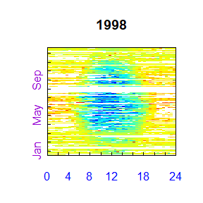
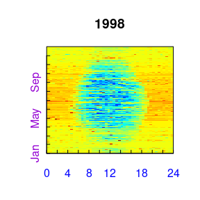
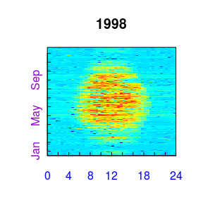

# REddyProc typical workflow

## Importing the half-hourly data
The workflow starts with importing the data. In the example, a text file is 
loaded and a timestamp is computed from the time specified by several separate 
columns before initializing the `sEddyProc` class.


```r
#+++ load libraries used in this vignette
library(REddyProc)
library(dplyr)
#+++ Load data with 1 header and 1 unit row from (tab-delimited) text file
fileName <- getExamplePath('Example_DETha98.txt', isTryDownload = TRUE)
EddyData.F <- if (length(fileName)) fLoadTXTIntoDataframe(fileName) else
  # or use example dataset in RData format provided with REddyProc
  Example_DETha98
#+++ Add time stamp in POSIX time format
EddyDataWithPosix.F <- fConvertTimeToPosix(EddyData.F, 'YDH',Year.s = 'Year'
    ,Day.s = 'DoY',Hour.s = 'Hour')
#+++ Initalize R5 reference class sEddyProc for post-processing of eddy data
#+++ with the variables needed for post-processing later
EddyProc.C <- sEddyProc$new('DE-Tha', EddyDataWithPosix.F, 
	c('NEE','Rg','Tair','VPD', 'Ustar'))
```


A fingerprint-plot of the source half-hourly shows already several gaps.
A fingerprint-plot is a color-coded image of the half-hourly fluxes by daytime 
on the x and and day of the year on the y axis. 

```r
EddyProc.C$sPlotFingerprintY('NEE', Year.i = 1998)
```

<!-- -->

For writing plots of data of several years to pdf see also

* [`sEddyProc_sPlotFingerprint`](../html/sEddyProc_sPlotFingerprint.html),
* [`sEddyProc_sPlotHHFluxes`](../html/sEddyProc_sPlotHHFluxes.html), and
* [`sEddyProc_sPlotDiurnalCycle`](../html/sEddyProc_sPlotDiurnalCycle.html).

## Estimating the uStar threshold distribution
The second step, is the estimation of the  distribution of uStar thresholds, to
identify periods of low friction velocity (uStar), where NEE is biased low. 
Discarding periods with low uStar is one of the largest sources of uncertainty 
in aggregated fluxes. Hence, several quantiles of the distribution of 
the uncertain uStar threshold are estimated by a bootstrap.

The friction velocity, uStar, needs to be in column named "Ustar" of the input 
dataset.


```r
uStarTh <- EddyProc.C$sEstUstarThresholdDistribution(
  nSample = 100L, probs = c(0.05, 0.5, 0.95)) 
#filter(uStarTh, aggregationMode == "year")
select(uStarTh, -seasonYear)
```

```
##   aggregationMode  season     uStar        5%       50%       95%
## 1          single    <NA> 0.4162500 0.3720889 0.4639444 0.6842286
## 2            year    <NA> 0.4162500 0.3720889 0.4639444 0.6842286
## 3          season 1998001 0.4162500 0.3720889 0.4639444 0.6842286
## 4          season 1998003 0.4162500 0.3164477 0.4034048 0.5927582
## 5          season 1998006 0.3520000 0.3139111 0.3833889 0.4561000
## 6          season 1998009 0.3369231 0.2092933 0.3854911 0.5267769
## 7          season 1998012 0.1740000 0.2371250 0.4387708 0.6735375
```


The output reports uStar estimates of 0.42 for 
the orignal data and 0.37, 0.46, 0.68 for lower, median, 
and upper quantile of the estimated distribution. The threshold can vary between
periods of different surface roughness, e.g. before and after harvest.
Therefore, there are estimates for different time periods, called seasons, reported
as different rows. These season-estimates can be aggregated to entire years or to
a single value across years, reported by rows with corresponding aggregation mode.

The subsequent post processing steps will be repeated using the three quantiles of 
the uStar distribution. They require to specify a uStar-threshold for each 
season and a suffix to distinguish the outputs related to different thresholds.

Here, we decide to use the same annually aggregated uStar threshold estimate 
in each season within a year. Further, we store the column names from the 
estimation result to variable `uStarSuffixes`, in order to distinguish 
generated columns.

```r
uStarThAnnual <- usGetAnnualSeasonUStarMap(uStarTh)[-2]
uStarSuffixes <- colnames(uStarThAnnual)[-1]
print(uStarThAnnual)
```

```
##    season       U05       U50       U95
## 1 1998001 0.3720889 0.4639444 0.6842286
## 2 1998003 0.3720889 0.4639444 0.6842286
## 3 1998006 0.3720889 0.4639444 0.6842286
## 4 1998009 0.3720889 0.4639444 0.6842286
## 5 1998012 0.3720889 0.4639444 0.6842286
```

## Gap-filling
The second post-processing step is filling the gaps using information of the 
valid data. Here, we decide to use the same annual uStar threshold estimate 
in each season, as obtained above, and decide to compute uncertainty also 
for valid records (FillAll). 


```r
EddyProc.C$sMDSGapFillAfterUStarDistr('NEE',
   UstarThres.df = uStarThAnnual,
   UstarSuffix.V.s = uStarSuffixes,
	 FillAll = TRUE
)
```

The screen output (not shown here) already shows that the uStar-filtering and
gap-filling was repeated for each given estimate of the uStar threshold
, i.e. column in 
`uStarThAnnual`, with marking 22% to 38% of the data as gap. 
For gap-filling without prior uStar-filtering using `sEddyProc_sMDSGapFill`
or for applying single or user-specified uStar thresholds using 
`sEddyProc_sMDSGapFillAfterUstar`
see `vignette("uStarCases")`.

For each of the different uStar threshold estimates
a separate set of output columns of filled NEE and its 
uncertainty is generated, distinguished by the suffixes given with 
`uStarSuffixes`. Suffix "_f" denotes the filled value and "_fsd" the 
estimated standard devation of its uncertainty.


```r
grep("NEE_.*_f$",names(EddyProc.C$sExportResults()), value = TRUE)
grep("NEE_.*_fsd$",names(EddyProc.C$sExportResults()), value = TRUE)
```

```
## [1] "NEE_U05_f" "NEE_U50_f" "NEE_U95_f"
## [1] "NEE_U05_fsd" "NEE_U50_fsd" "NEE_U95_fsd"
```

A fingerprint-plot of one of the new variables shows that gaps have been filled.

```r
EddyProc.C$sPlotFingerprintY('NEE_U50_f', Year.i = 1998)
```

<!-- -->


## Partitioning net flux into GPP and Reco

The third post-processing step is partitioning the net flux (NEE) into its gross 
components GPP and Reco.
The partitioning needs to distinguish carefully between night-time and day-time. 
Therefore it needs a specification of geographical coordinates and time zone 
to allow computing sunrise and sunset. Further, the missing values in the 
used meteorological data need to be filled. 

```r
EddyProc.C$sSetLocationInfo(Lat_deg.n = 51.0, Long_deg.n = 13.6, TimeZone_h.n = 1)  
EddyProc.C$sMDSGapFill('Tair', FillAll.b = FALSE)     
EddyProc.C$sMDSGapFill('VPD', FillAll.b = FALSE)     
```

Now we are ready to invoke the partitioning, here by the night-time approach, 
for each of the several filled NEE columns.

```r
#variable uStarSuffixes was defined above at the end of uStar threshold estimation
resPart <- lapply(uStarSuffixes, function(suffix){
					 EddyProc.C$sMRFluxPartition(Suffix.s = suffix)
				})
```


The results are stored in columns `Reco` and `GPP_f` modified by the respective 
uStar threshold suffix. 

```r
grep("GPP.*_f$|Reco",names(EddyProc.C$sExportResults()), value = TRUE)
```

```
## [1] "Reco_U05"  "GPP_U05_f" "Reco_U50"  "GPP_U50_f" "Reco_U95"  "GPP_U95_f"
```

Visualizations of the results by a fingerprint plot gives a compact overview. 

```r
EddyProc.C$sPlotFingerprintY('GPP_U50_f', Year.i = 1998)
```

<!-- -->

For using daytime-based flux partitioning see [`sEddyProc_sGLFluxPartition`](../html/sEddyProc_sGLFluxPartition.html) 
computing columns `GPP_DT` and `Recco_DT`.

## Estimating the uncertainty of aggregated results

First we compute the mean of the GPP across all the year for each scenario.

```r
FilledEddyData.F <- EddyProc.C$sExportResults()
#suffix <- uStarSuffixes[2]
GPPAgg <- sapply( uStarSuffixes, function(suffix) {
	GPPHalfHour <- FilledEddyData.F[[paste0("GPP_",suffix,"_f")]]
	mean(GPPHalfHour, na.rm = TRUE)
})
print(GPPAgg)
```

```
##      U05      U50      U95 
## 5.008512 5.155009 5.261060
```

The difference between those aggregated values is a first estimate of 
uncertainty range in GPP due to uncertainty of the uStar threshold.

```r
(max(GPPAgg) - min(GPPAgg)) / median(GPPAgg) 
```
In this run of the example a relative error of about 4.9% is inferred.

For a better but time consuming uncertainty estimate, specify a larger sample 
in estimation of uStar threshold distribution above and compute statistics 
from the larger sample across the corresponding GPP columns.

```r
sEstUstarThresholdDistribution( 
  nSample = 200, probs = seq(0.025,0.975,length.out = 39) )
```

## Storing the results in a csv-file

The results still reside inside the `sEddyProc` class. 
We first export them to an R Data.frame, append the columns to the original 
input data, and write this data.frame to text file in a temporary directory.

```r
FilledEddyData.F <- EddyProc.C$sExportResults()
CombinedData.F <- cbind(EddyData.F, FilledEddyData.F)
fWriteDataframeToFile(CombinedData.F, 'DE-Tha-Results.txt', Dir.s = tempdir())
```


